# Configurando o Bind9

Bind é o servidor para o protocolo DNS mais utilizado na Internet, especialmente em sistemas do tipo Unix, onde ele pode ser considerado um padrão de facto. Foi criado por quatro estudantes de graduação, membros de um grupo de pesquisas em ciência da computação da Universidade de Berkeley, e foi distribuído pela primeira vez com o sistema operacional 4.3BSD. O programador Paul Vixie, enquanto trabalhava para a empresa DEC, foi o primeiro mantenedor do BIND. Atualmente o BIND é suportado e mantido pelo Internet Systems Consortium.

## Instalando o bind9
```sh
$ sudo apt update
$ sudo apt install sudo apt-get install bind9 dnsutils bind9-doc
```
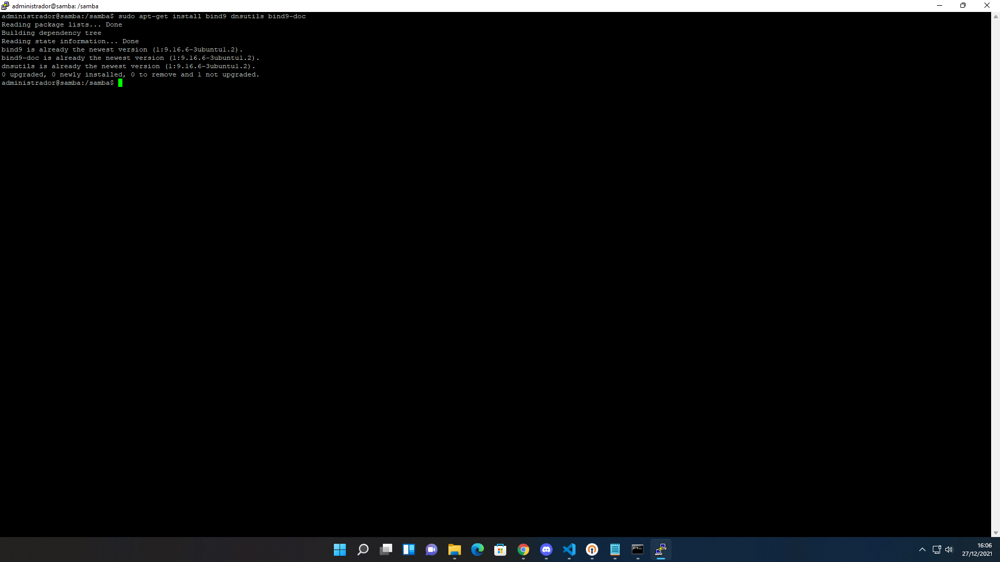

Vamos ver se está rodando corretamente

```sh
$ sudo systemctl status bind9
```
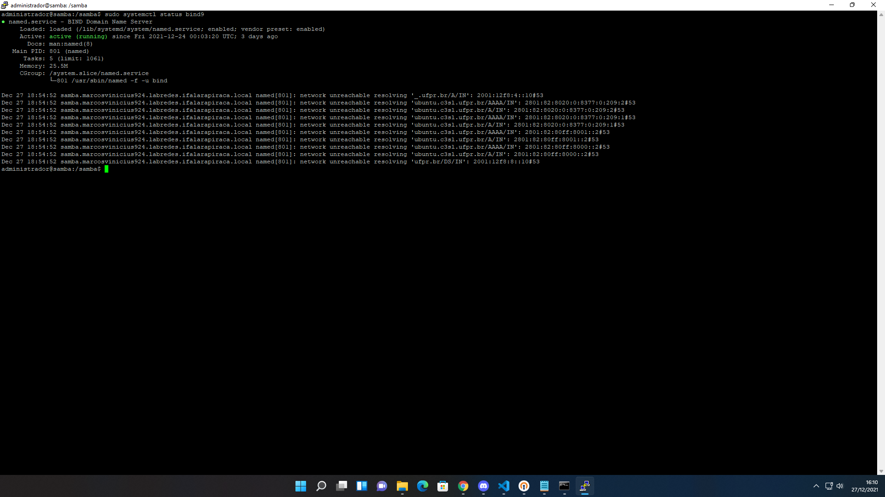

Agora com o bind9 configurado, precisamos configuarar as zonas que serão utilizadas no nosso "sistema de diretórios customizados" dentro do dns via bind9.

* Vamos criar a pasta onde serão armazenadas as zonas
  ```sh
  $ sudo mkdir /etc/bind/zones
  ```
* agora precisamos configurar as zonas
  ```sh
  $ sudo cp /etc/bind/db.empty /etc/bind/zones/db.jonathanmarcos924.labredes.ifalarapiraca.local

  $ sudo vim /etc/bind/zones/db.jonathanmarcos924.labredes.ifalarapiraca.local
  ```
  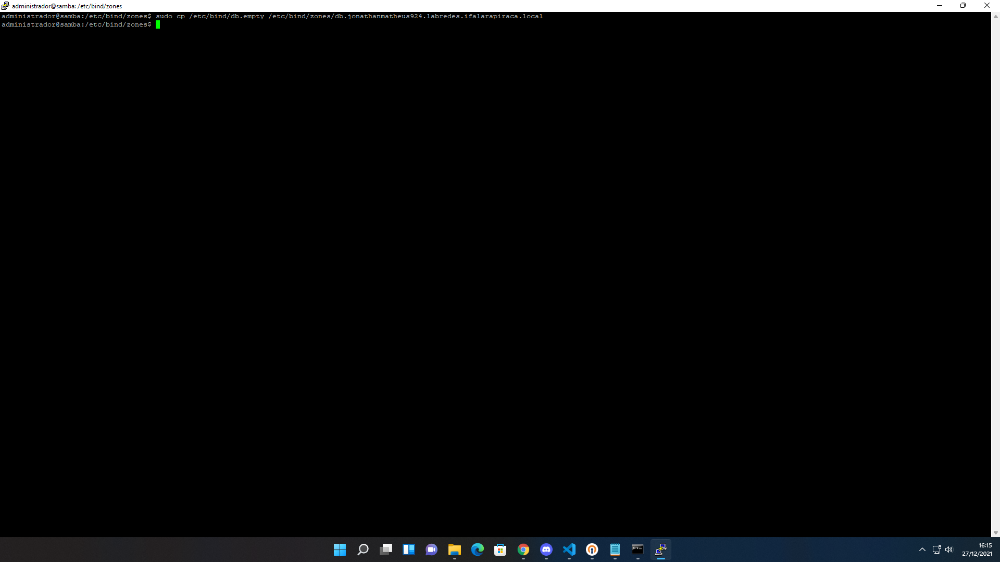
* editamos o arquivo de zona direta colocando as informações referentes a dupla e ao sistema de nomes que será usado
  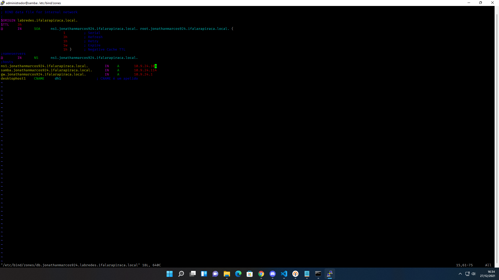
  * agora criamos o arquivo de zona inversa, usando o IP referente da nossa máquina e template existente no bind9 bem semelhante a como foi configurado o direto
  * editamos o arquivo criado de configuração para inserir os dados referentes a nossa rede usando o comando
  ```sh
  $ sudo nano /etc/bind/zones/db.10.9.24.rev
  ```
  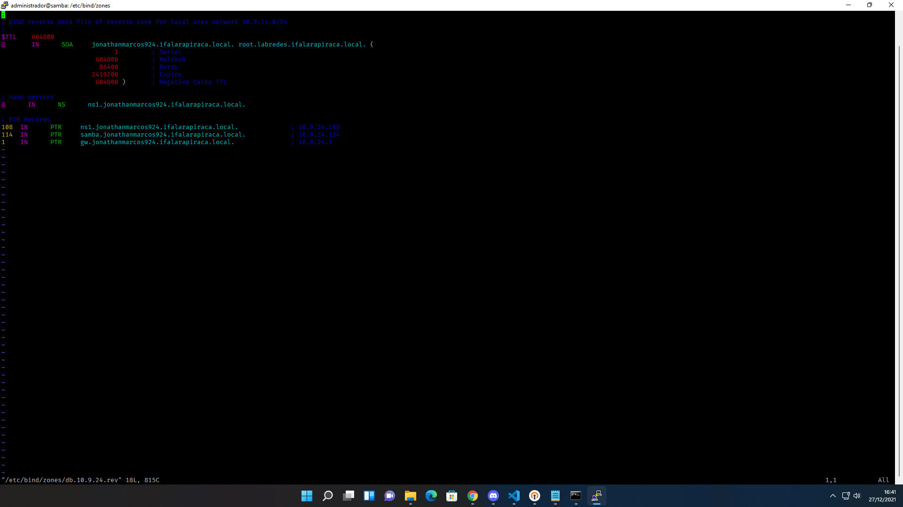

* com os arquivos de zona devidamente configurados devemos agora ativa-los dentro da configuração do serviço de nomes, pra isso, precisamos editar o arquivo `/etc/bind/named.conf.local`
  ```sh
  $ sudo nano /etc/bind/named.conf.local
  ```
  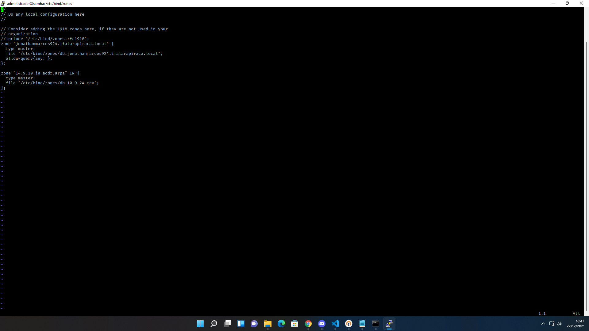
* após configurar o `named.conf.local` podemos testar a sintaxe usando o comando
  ```sh
  $ sudo named-checkconf
  ```
* então, iremos configurar o arquivo `/etc/default/named` para permitir resolver endereços IPv4
  ```sh
  $ sudo vim /etc/default/named
  ```
  > Adicionar a linha OPTIONS="-4 -u bind"

  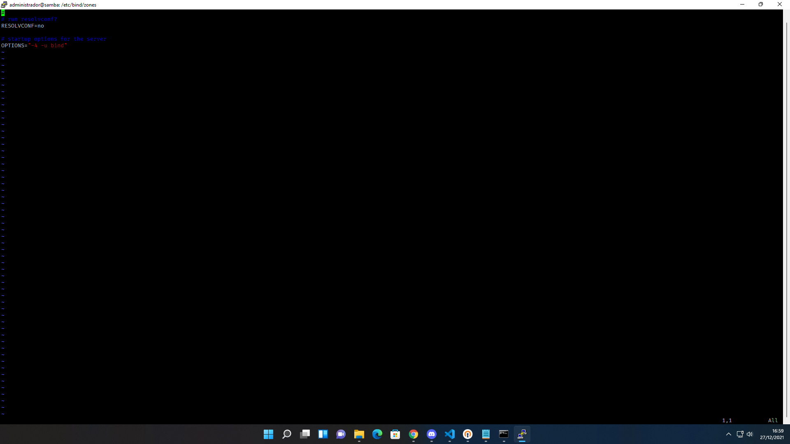

* Executar o serviço do bind9
  ```sh
  $ sudo systemctl enable bind9

  $ sudo systemctl restart bind9
  ```

### Agora devemos adicionar o DNS ao netplan
* Editando o arquivo base
  ```sh
  $ sudo vim /etc/netplan/50-cloud-init.yaml
  ```
  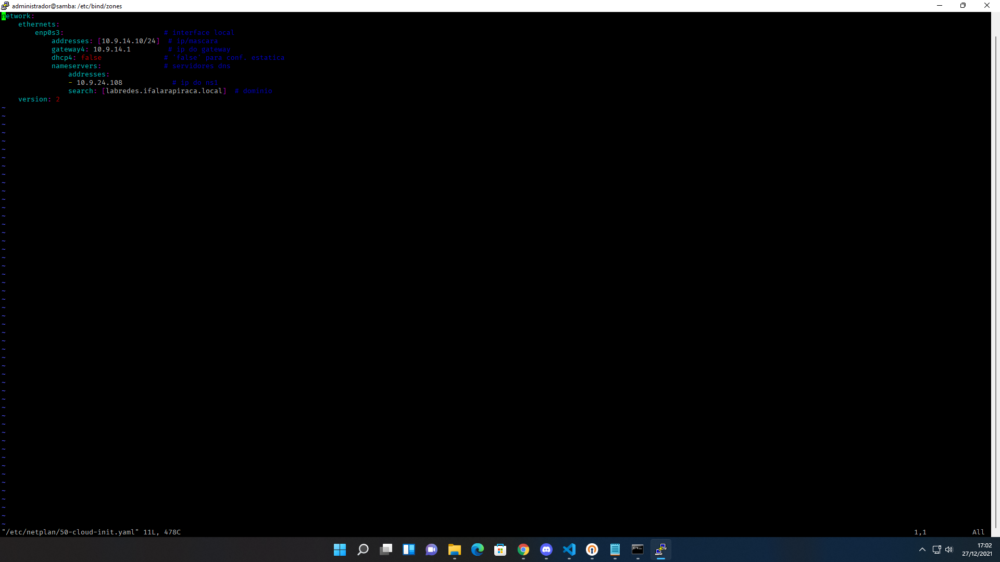
* Para resolver os DNS configurados e verificar os campos
  ```sh
  $ resolvectl status
  ```
  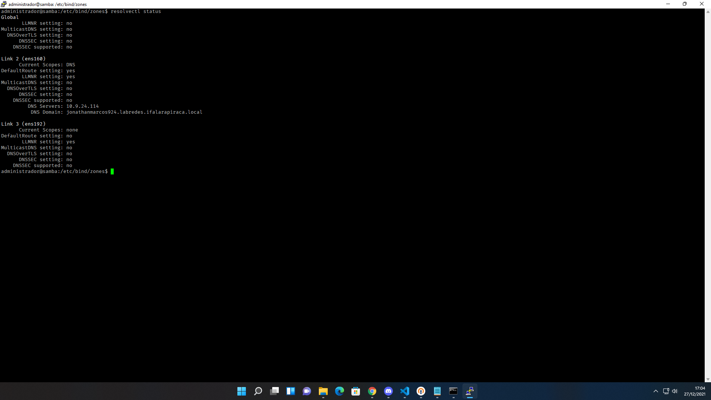

## Testes
* Teste de DNS para a maquina ns1
  ```sh
  $ dig ns1.jonathanmarcos924.labredes.ifalarapiraca.local
  ```
  
* Teste de DNS para a máquina do samba
  ```sh
  $ dig samba.jonathanmarcos924.labredes.ifalarapiraca.local
  ```
  

* Teste de DNS para a máquina do gateway
  ```sh
  $ dig gw.jonathanmarcos924.labredes.ifalarapiraca.local
  ```
  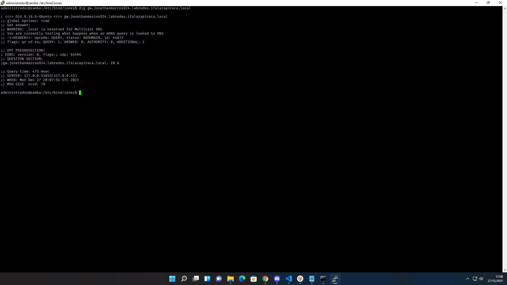

* Teste de DNS reverso para a máquina
  ```sh
  $ dig 10.9.24.114 
  ```
  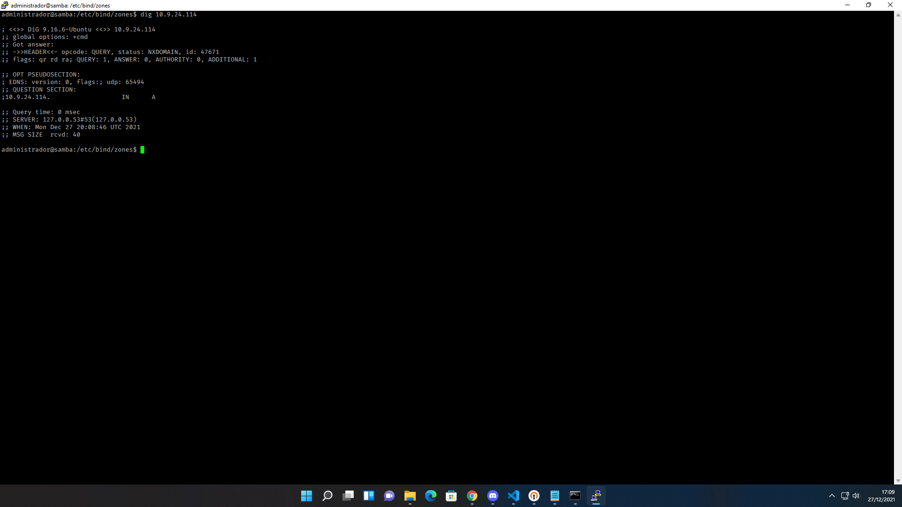

* Teste ping samba
  ```sh
  $ ping samba
  ```
  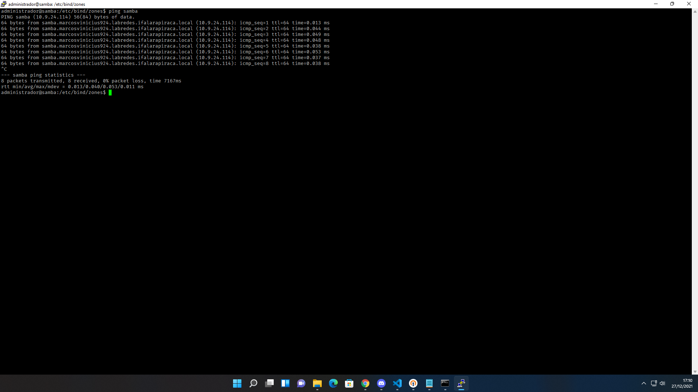

## Veja tambem:
Configurando o samba: [Samba](SAMBA.md)

Configurando o dns slave: [DNS Slave](DNS.md)

