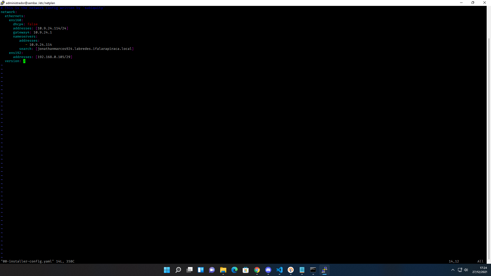
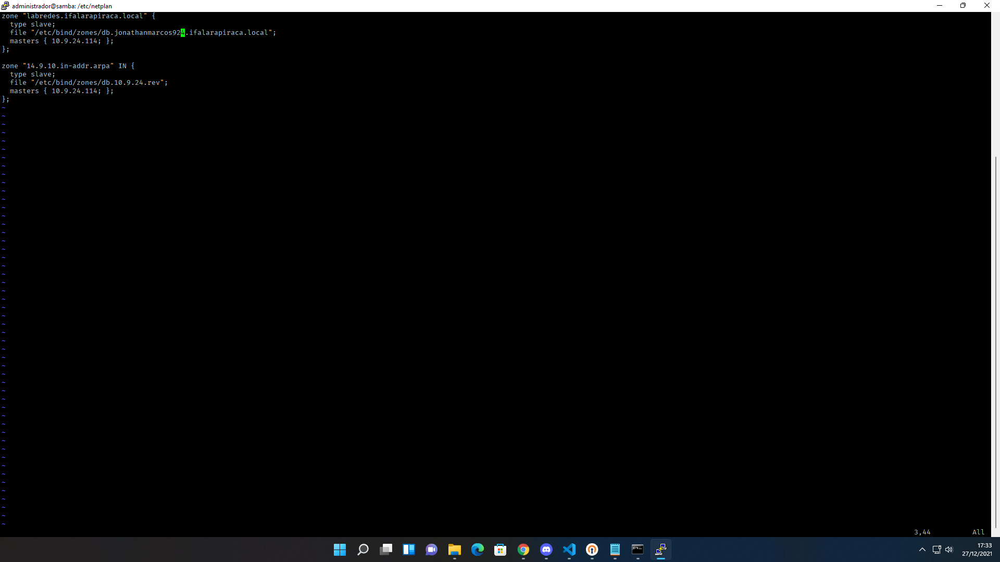
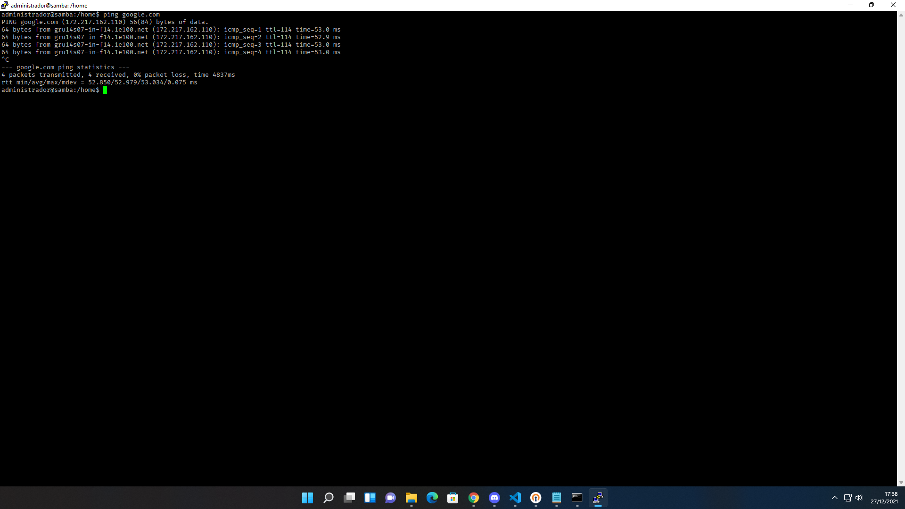

# Configurando o servidor DNS Slave
O DNS (Domain Name System), é responsável pela tradução de nomes, em endereços de IP. Todos os websites que visitamos têm associado um endereço de IP, além de nós só sabermos o seu nome, Neste caso ao visitarmos o techemportugues.com, estamos a aceder ao IP 37.60.245.152, mas é muito mais simples para o ser humano decorar techemportugues.com, do que 37.60.245.152.

##  Configurar o DNS master na interface de rede

```base
$ sudo nano /etc/netplan/00-instaler-config.yaml 
```
* Exemplo para a turma 914, para a turma 924 basta utilizar o prefixo de rede 10.9.24


   * Aplique as configurações
```sh
$ sudo netplan apply
``` 
   * veja se funcionou
```sh
$ ifconfig
```

### Configurar e instalar servidor DNS secundário (slave)
```sh
$ sudo apt-get install bind9 dnsutils bind9-doc -y
```

   * Verifique o status do serviço:
```sh
$ sudo systemctl status bind9
```

### configuração de zonas

```sh
$ sudo vim /etc/bind/named.conf.local
```


## Testes utilizando o ping
```sh
ping google.com
```
