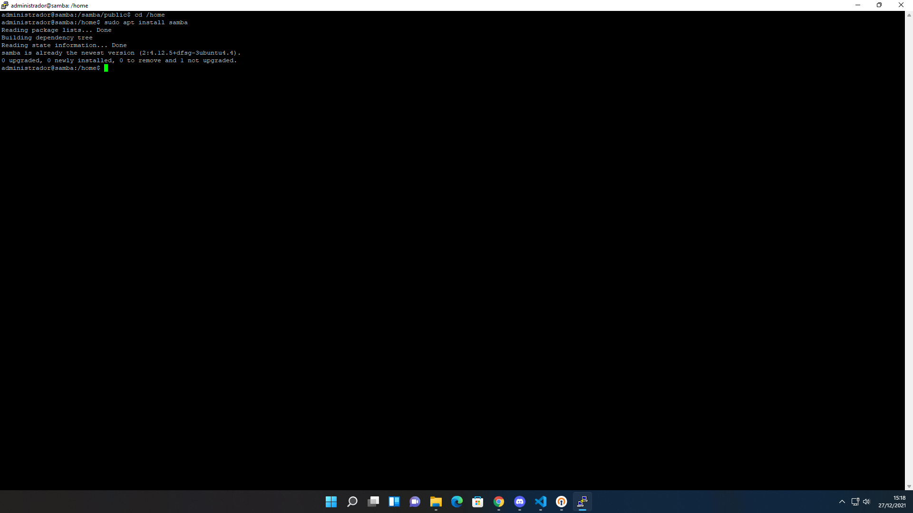
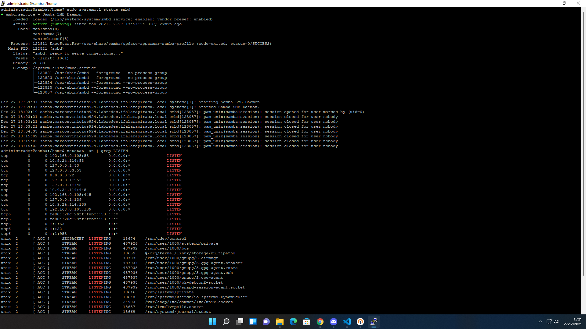
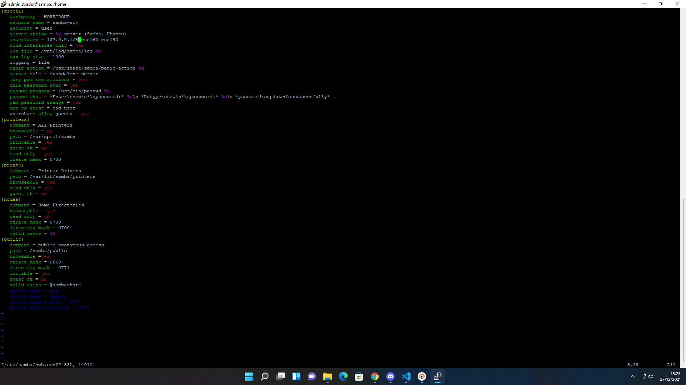
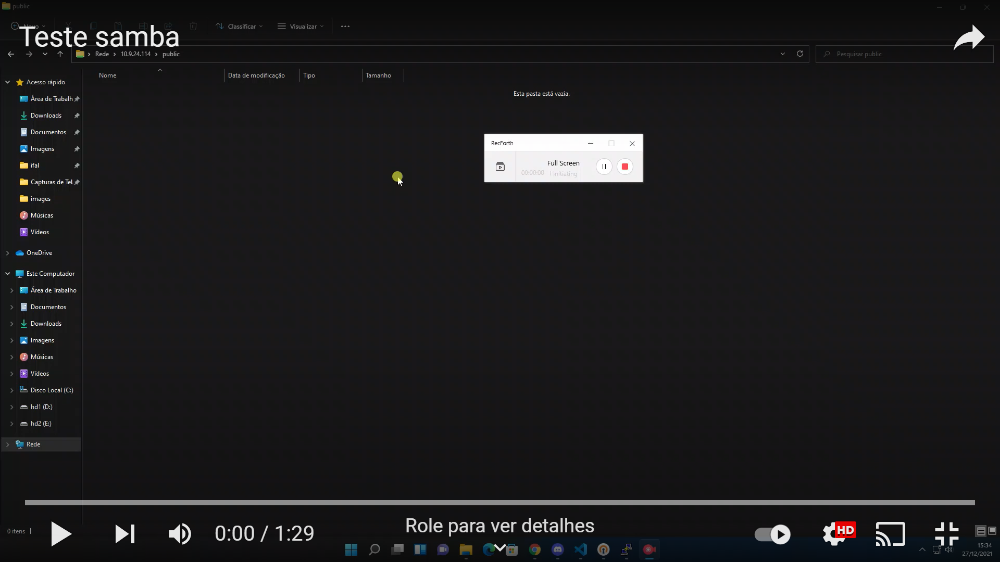

# Configurando Servidor Samba

> O Samba é um servidor de arquivos muito poderoso, que permite que não só consigamos compartilhar arquivos dentro de uma rede, mas ele atua como um serviço completo de simple storage, como o S3 da AWS ou Google Cloud Storage, com regras customizaveis e vários outros recursos

Antes de usarmos o Samba precisamos fazer a instalação do pacote

## Instalação
```shell
$ sudo apt update
$ sudo apt install samba
```


Após instalar podemos checar o status do funcionamento usando os comandos
```shell
$ sudo systemctl status smbd
$ netstat -an | grep LISTEN
```


> Com o samba em pleno funcionamento podemos fazer o backup das configurações iniciais dele e começarmos a personalizar!

## Configurando o Serviço
* abra o arquivo de configurações em `/etc/samba/smb.conf`
```shell
$ sudo vim /etc/samba/smb.conf
```
* agora vamos restringir o acesso aos usuários do grupo sambashare e adicionar opções de configurações mais especificas pra rede

* após configurarmos o samba, reiniciaremos o serviço pra que ele possa aplicar as configurações
```shell
$ sudo systemctl restart smbd
```
* após a reinicialização iremos configurar os dados de autenticação dentro do samba para permitir acessa-lo por via de uma autenticação baseada em senha, usando os comandos
```shell
$ sudo adduser aluno
$ sudo smbpasswd -a aluno
$ sudo usermod -aG sambashare aluno
```
## Compartilhando arquivos
> Após a configuração do serviço do samba precisamos liberar pra ele uma pasta ao qual ele usará como repositório aberto do servidor de arquivos

* para aplicar o compartilhamento precisamos criar uma pasta chamada sambashare na home da máquina, e então criar uma pasta public num diretório samba na raiz, usando os comandos:
```shell
$ mkdir /home/aluno/sambashare/
$ sudo mkdir -p /samba/public
```
* agora após a criação da pasta, devemos dar as devidas permições às mesmas
```shell
$ sudo chown -R nobody:nogroup /samba/public
$ sudo chmod -R 0775 /samba/public
$ sudo chgrp sambashare /samba/public
```

# Teste de compartilhamento
Assista o video abaixo para ver o samba rodando:

[](https://www.youtube.com/watch?v=RHCmBywV_Mg&ab_channel=MarcosVas)
